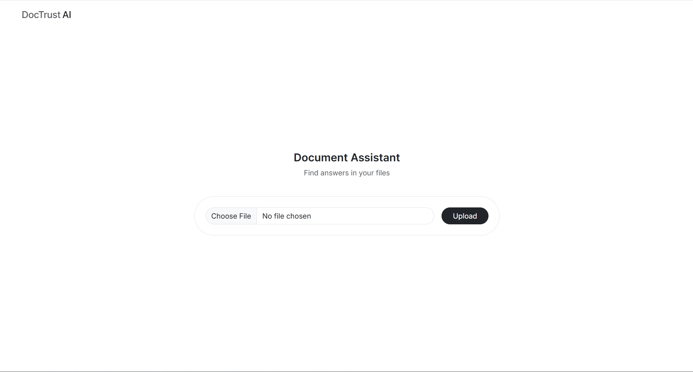

# DocTrustAI

An AI document assistant that answers questions from your PDFs while preventing hallucinations.

Most RAG systems will generate an answer regardless of whether the document actually contains the information or not. DocTrustAI doesn't. It evaluates retrieval confidence score before passing anything to the LLM, and if the context isn't strong enough, it blocks the response entirely and tells you why.

**Live Demo:** [doctrustai.up.railway.app](https://doctrustai.up.railway.app/) &nbsp;|&nbsp; **GitHub:** [github.com/yashsharma98/doctrust-ai](https://github.com/yashsharma98/doctrust-ai)

---

## Key Features

- Confidence aware RAG pipeline that blocks low scored responses
- Hybrid retrieval (BM25 + vector search) with Reciprocal Rank Fusion (RRF)
- Cross encoder reranking for improved relevance
- Threshold based hallucination mitigation layer
- Fallback responses when context is insufficient

---

## Screenshots



---

## How It Works

When you ask a question, DocTrustAI runs it through these three stage retrieval pipeline before sending it to LLM:

**Stage 1 - Hybrid Retrieval :**
BM25 keyword search and vector similarity using ChromaDB. The rankings are then merged using Reciprocal Rank Fusion (RRF) which produces much better results .

**Stage 2 - Cross-Encoder Reranking :**
The top 20 merged results get re-scored by a cross-encoder model `ms-marco-MiniLM-L-6-v2`. This model looks at the question and each chunk together rather than separately to better understand the query relevance.

**Stage 3 - Confidence Score :**
The top 3 reranked chunks go through a confidence scoring layer. If none of them clear the threshold, a separate prompt explains what information was found and what's missing — the main answer generation is blocked to prevent hallucination.

If the confidence threshold is met Gemini generates a response from the retrieved context. Otherwise, the system returns a structured explanation instead of generating a hallucinated answer.

---

## Tech Stack

| Layer | Technology |
|---|---|
| Backend | Python, Django |
| Embeddings | Sentence Transformers (`all-MiniLM-L6-v2`) |
| Vector Database | ChromaDB Cloud |
| Keyword Search | BM25 |
| Reranking | Cross-Encoder (`ms-marco-MiniLM-L-6-v2`) |
| LLM | Gemini API |
| PDF Parsing | PyMuPDF |
| Containerization | Docker |

---

## Getting Started

### Option 1 - Docker (Recommended)

```bash
docker pull yashsharma31/doctrust-ai:latest
```

Create a `.env` file in your project root:

```dotenv
GEMINI_API_KEY=your_gemini_api_key
CHROMA_API_KEY=your_chroma_api_key
CHROMA_TENANT=your_chroma_tenant
CHROMA_DATABASE=your_chroma_database
DJANGO_SECRET_KEY=your_django_secret_key
```

Run the container:

```bash
docker run --env-file .env -p 8000:8000 yourdockerhubusername/doctrust-ai:latest
```

Open [http://localhost:8000](http://localhost:8000) in your browser.

---

### Option 2 - Run Locally

**Prerequisites:** Python 3.11

```bash
git clone https://github.com/yashsharma98/doctrust-ai
cd doctrust-ai
```

Create and activate a virtual environment:

```bash
python -m venv venv
venv\Scripts\activate
```

Install dependencies:

```bash
pip install -r requirements.txt
```

Create a `.env` file with the same variables listed above, then run:

```bash
python manage.py migrate
python manage.py runserver
```

Open [http://localhost:8000](http://localhost:8000)

---

## Why Not Just Cosine Similarity?

Cosine similarity alone ranks chunks by how close they are in embedding space, which works well for semantically similar text but misses exact keyword matches. BM25 is the opposite it is great for keywords, weaker on meaning. Combining both and fusing the rankings with RRF gives more robust retrieval than either alone.

The cross-encoder reranking step adds another layer so instead of scoring the query and chunks independently, it scores them together, which is a much stronger signal for relevance.

---

## Environment Variables

| Variable | Description |
|---|---|
| `GEMINI_API_KEY` | Gemini API key for response generation |
| `CHROMA_API_KEY` | ChromaDB Cloud API key |
| `CHROMA_TENANT` | ChromaDB tenant ID |
| `CHROMA_DATABASE` | ChromaDB database name |
| `DJANGO_SECRET_KEY` | Django secret key |